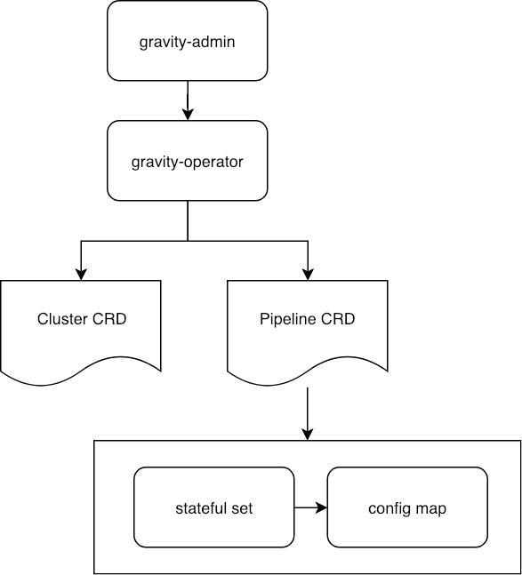

# Gravity Operator
[](https://travis-ci.com/moiot/gravity-operator)

Gravity Operator manages Gravity processes on Kubernetes.

## Getting Started

This document introduces how to deploy, configure and upgrade a Gravity Operator. 

### Prerequisites

- Kubernetes 1.11+ with CRD status subroutine
- [helm](https://helm.sh/)

### Installing

```bash
$ cd charts/gravity-operator
$ helm install --name gravity-operator ./
```

This chart bootstraps a gravity-operator deployment on a Kubernetes cluster using the Helm package manager.

## Gravity Cluster Configuration

The following table shows the configurable parameters of the gravity-operator chart and their default values. See `deploy/k8s/gravity-operator/values.yaml`.

Parameter | Description | Default Value
--- | --- | ---
`deploymentRules`| Array of deployment rules which control Gravity deployment versions | See [`DeploymentRules`](#DeploymentRules)  
`operator.image.repository`| Image of the operator | `moiot/gravity-operator`
`operator.image.tag`| Image tag of the operator | `v0.1.0`
`operator.rolling`| The maximum number of pipelines that can be upgraded in parallel. Value can be an absolute number (ex: 5) or a percentage (ex: 10%). | `25%`
`admin.image.repository`| Image of admin | `moiot/gravity-admin`
`admin.image.tag`| Image tag of admin | `v0.2.0`
`admin.service.nodePort`| Node port of the admin service | `30066`


By defining `DeploymentRule`, a Gravity cluster is divided into multiple groups based on the pipeline name and these groups can use different Gravity versions.

The default rule is as follows:

```yaml
  - group: "default"
    pipelines: ["*"]
    image: "moiot/gravity:v0.9.15"
    command: ["/gravity", "-config=/etc/gravity/config.json"]
```

Parameter | Type | Description
--- | --- | ---
`group`| String | Name of the rule
`pipelines`| String array | Global expression of the matched pipeline name
`image` | String | Image (including tag) of matched pipeline deployment. It will be written to pod template's container image field
`command` | String array | Command of running matched pipeline. It will be written to pod template's container command field

## Gravity Cluster Upgrade

To upgrade a Gravity cluster, perform the following steps:

1. Modify the `values.yaml` file in the chart.
2. Use [helm](https://helm.sh/) to upgrade the cluster.

## Architecture


## License

This project is licensed under the Apache License 2.0 License - see the [LICENSE](LICENSE) file for details